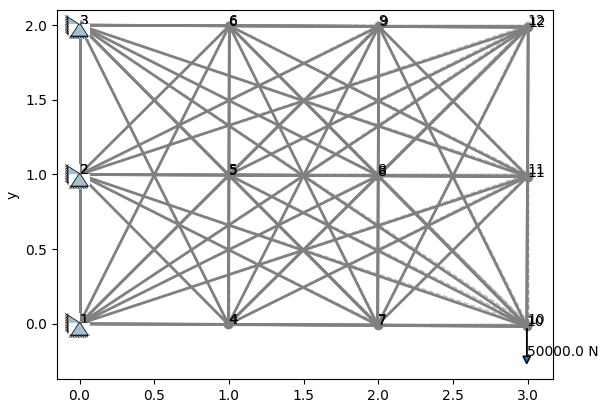
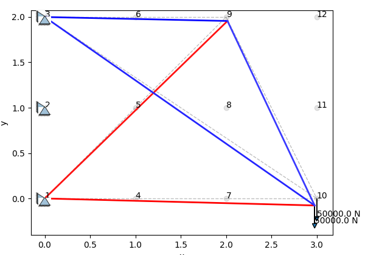
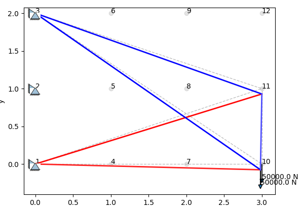
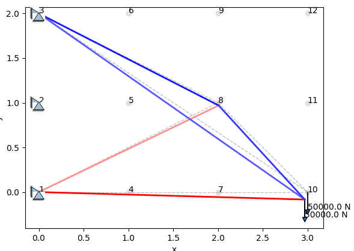
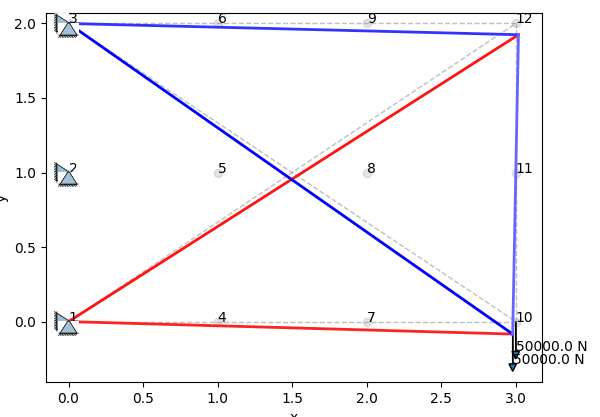
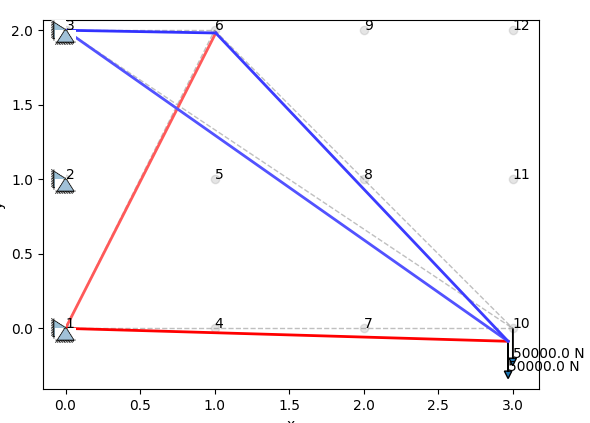

## Code Usage

Requirements:`numpy` and `matplotlib` are required for executing the python script.

```shell
python3 main.py
```


## problem definition

a full connected truss structure **(3 meter * 2 meter)**: left side of the structure are fixed, its right side is loaded by **50kN**. 

| material properties  |       | unit   |
| -------------------- | ----- | ------ |
| cross section        | 200   | $mm^2$ |
| module of elasticity | 29000 | $E$    |

**object**: minimize the material usage of the structure

**constraints**:

1.  maximal nodal displacement no bigger than 0.1m
2. maximal stress of each linkage don't exceed 300 MPa




## methods


## results

- green means linkage with tension

- red means linkage with compression











